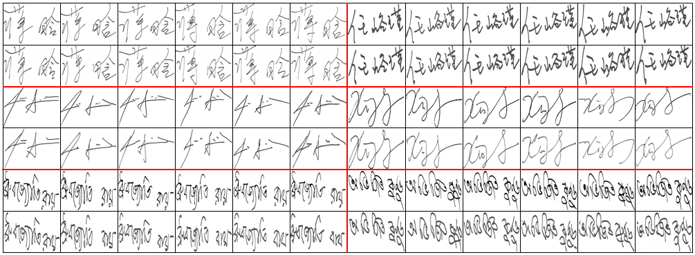

# Signature-Image-Generation
Our model is implemented with PyTorch 1.8.1 and Python 3.7.
## Training
Input the images in pairs and directly run the train.py file:
```python
python train.py
```
For dataset download instructions, please refer to the dataset/dataset_url.txt file.
## Result
Original images and signature images generated using the method for different datasets. Original images are shown above, with corresponding generated images below. Each pair of rows is from a different language dataset, in the order of Chinese, English, and Bengali.

## Note
As the paper has not yet been published, we have only uploaded the training code for now. Once the paper is completed and published, we will consider open-sourcing the full code. Thank you for your understanding and support !
